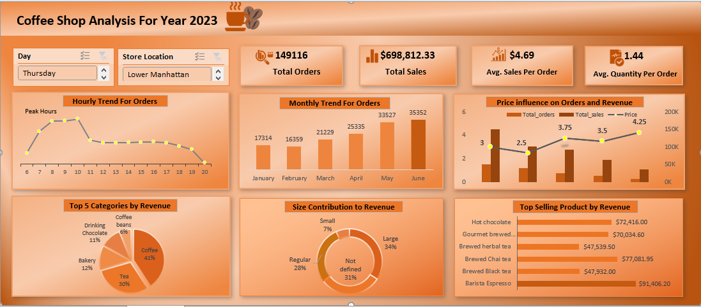
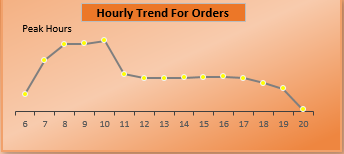
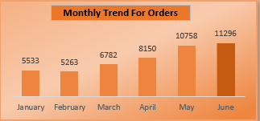
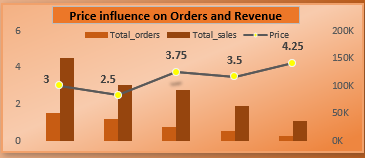
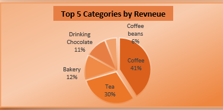
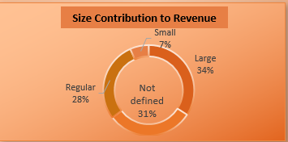
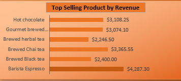
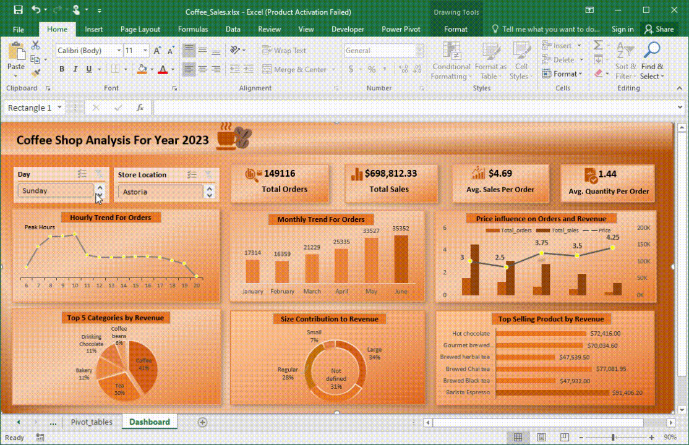

# Coffee Shop Sales Analysis

## Overview

This project leverages Microsoft Excel to analyze and visualize sales data from a coffee shop. The focus is on identifying trends and key metrics through various chart types, including line charts, column charts, and combo charts. These insights are intended to support data-driven decision-making and improve business strategies.

## Project Structure

This repository contains the following components:

- **`Data/`**: Data files in Excel format can be downloaded from the following link

  https://mavenanalytics.io/data-playground?accessType=open&order=date_added%2Cdesc&page=5&pageSize=5
  
- **`Analysis/`**: Excel workbooks "Coffee_Sales.xlsx" with pivot tables and charts used for the analysis.
- **`PowerPoint Presentation/`**: "COFFEE SHOP SALES ANALYSIS REPORT.pptx" contains requirements, insights and recommendations regarding this project 
- **`README.md`**: This file, providing an overview of the project.

## Getting Started

To get started with the Coffee Shop Sales Analysis project, follow these steps:

1. **Access the Analysis Workbook**:

   Open the Excel workbook(s). This workbook includes the pivot tables and charts used for analyzing the sales data.

2. **Explore the Analysis**:

   Review the following charts and tables to understand the sales patterns:

   - **Peak Hours**:
     - **Chart Type**: Line Chart with Markers
     - **Description**: Displays trends in orders across different hours of the day, highlighting peak and off-peak hours with markers for clarity.

   - **Monthly Trends**:
     - **Chart Type**: Column Chart
     - **Description**: Shows the trend of monthly orders, helping to identify seasonal variations and overall performance within a year.

   - **Price Trend**:
     - **Chart Type**: Combo Chart
     - **Description**: Illustrates the trend of sales and orders across different price ranges, helping to understand how price impacts sales and orders.

   - **Sales Contribution by Category**:
     - **Chart Type**: Pie Chart
     - **Description**: Represents the percentage contribution of different sales categories to total sales.

   - **Sales by Size**:
     - **Chart Type**: Donut Chart
     - **Description**: Displays the contribution of various product sizes to total sales, offering insights into size preferences.

   - **Sales by Product**:
     - **Chart Type**: Bar Chart
     - **Description**: Compares sales figures for different products, identifying best-sellers.

## Analysis Details

### Key Metrics
- **Total Sales**: Total revenue generated.
- **Total Orders**: Total number of orders placed.
- **Average Quantity sold**: Average quantity of products sold per order.
- **Average Sales**: Average sales generated per order.  
- **Peak Hours**: Trends and patterns of orders throughout the day, with peak hours highlighted.
- **Monthly Trends**: Sales performance across different months, revealing seasonal effects.
- **Price Trend**: Analysis of sales trends in relation to different price ranges.
- **Category Contribution**: Distribution of sales across different categories.
- **Size Contribution**: Sales performance by product size.
- **Product Sales**: Comparative sales data for various products.

### Visualizations

- **Line Chart with Markers**: Used for analyzing peak hours and highlighting specific trends.
  

  
- **Column Chart**: Displays monthly sales trends and variations.

  
- **Combo Chart**: Shows price trends and their impact on sales.

 
- **Pie Chart**: Visualizes percentage contributions by category.

 

- **Donut Chart**: Illustrates sales distribution by product size.

 

- **Bar Chart**: Compares sales figures across different products.

 

## Dashboard Preview

 
